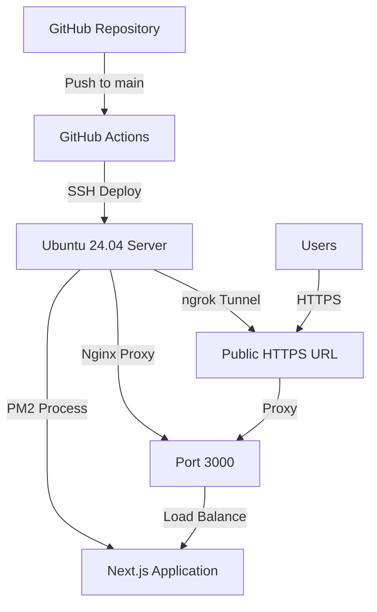

# Portfolio Website - Sandeep Dommaraju

[](https://github.com/Sandeep-dommar01/Protifoilo)
[](https://nextjs.org/)
[](https://www.typescriptlang.org/)
[](https://tailwindcss.com/)

A modern, responsive portfolio website showcasing cybersecurity expertise, built with Next.js and TypeScript. Features automated CI/CD deployment to a private Ubuntu server with comprehensive DevOps infrastructure.

## 🌐 Live Website

**Portfolio URL:** [[Deployed via private Ubuntu server with ngrok tunneling]](https://4c6c-2603-6010-f900-6fe3-369a-7b0f-9313-f0ec.ngrok-free.app/)

## 📋 Table of Contents

- [Tech Stack](#-tech-stack)
- [Features](#-features)
- [Project Structure](#-project-structure)
- [Local Development](#-local-development)
- [Deployment Architecture](#-deployment-architecture)
- [CI/CD Pipeline](#-cicd-pipeline)
- [Infrastructure Setup](#-infrastructure-setup)
- [Security Configuration](#-security-configuration)
- [Docker Configuration](#-docker-configuration)
- [Troubleshooting](#-troubleshooting)
- [Contributing](#-contributing)

## 🛠️ Tech Stack

### Frontend Technologies
- **[Next.js 15](https://nextjs.org/)** - React framework with App Router and Turbopack
- **[TypeScript](https://www.typescriptlang.org/)** - Type-safe JavaScript development
- **[Tailwind CSS](https://tailwindcss.com/)** - Utility-first CSS framework
- **[React 18](https://reactjs.org/)** - Component-based UI library
- **[PostCSS](https://postcss.org/)** - CSS post-processing

### DevOps & Infrastructure
- **[Ubuntu 24.04 Server](https://ubuntu.com/)** - Self-hosted deployment target
- **[PM2](https://pm2.keymetrics.io/)** - Production process manager
- **[Nginx](https://nginx.org/)** - Reverse proxy and web server
- **[Docker](https://www.docker.com/)** - Application containerization
- **[ngrok](https://ngrok.com/)** - Secure tunneling service
- **[GitHub Actions](https://github.com/features/actions)** - CI/CD automation

### Security & Networking
- **SSH Key Authentication** - Secure server access (Port 436)
- **UFW Firewall** - Ubuntu firewall management
- **HTTPS Encryption** - Secure connections via ngrok
- **Systemd Services** - Service lifecycle management

## ✨ Features

### Website Features
- 🎯 **Multi-page Portfolio** - Home, About, Experience, Projects, Contact
- 📱 **Responsive Design** - Mobile-first approach with hamburger navigation
- 🎨 **Professional UI** - Clean, minimal design with modern aesthetics
- ⚡ **Fast Performance** - Optimized with Next.js and Turbopack
- 🔍 **SEO Optimized** - Proper meta tags and semantic structure
- 🌙 **Accessibility** - WCAG compliant design patterns

### DevOps Features
- 🚀 **Automated Deployment** - Git push triggers full deployment pipeline
- 🔄 **Zero-Downtime Deploys** - PM2 reload strategy with health checks
- 🏠 **Self-Hosted Infrastructure** - Complete control over hosting environment
- 🔐 **Secure Tunneling** - Public access via authenticated ngrok tunnel
- 📊 **Service Monitoring** - Real-time application health tracking
- 📦 **Containerized** - Docker support for consistent environments

## 📁 Project Structure

```
portfolio/
├── 📂 src/
│   ├── 📂 app/
│   │   ├── 📄 layout.tsx          # Root layout component
│   │   ├── 📄 page.tsx            # Homepage (Hero + Skills)
│   │   ├── 📄 globals.css         # Global styles
│   │   ├── 📂 about/
│   │   │   └── 📄 page.tsx        # About page (Education, Skills)
│   │   ├── 📂 experience/
│   │   │   └── 📄 page.tsx        # Work experience timeline
│   │   ├── 📂 projects/
│   │   │   └── 📄 page.tsx        # Project showcase
│   │   └── 📂 contact/
│   │       └── 📄 page.tsx        # Contact information
│   └── 📂 components/             # Reusable React components
├── 📂 .github/
│   └── 📂 workflows/
│       └── 📄 deploy.yml          # GitHub Actions CI/CD pipeline
├── 📂 public/
│   ├── 📄 favicon.ico
│   └── 🖼️ [static assets]
├── 📂 scripts/
│   ├── 📄 deploy.sh              # Main deployment script
│   ├── 📄 deploy-enhanced.sh     # Enhanced deployment with logging
│   ├── 📄 deploy-nodejs.sh       # Node.js specific deployment
│   └── 📄 deploy-windows.ps1     # PowerShell deployment script
├── 📄 Dockerfile                 # Docker container configuration
├── 📄 ecosystem.config.js        # PM2 process configuration
├── 📄 portfolio_nginx.conf       # Nginx server configuration
├── 📄 next.config.ts             # Next.js configuration
├── 📄 tailwind.config.js         # Tailwind CSS configuration
├── 📄 tsconfig.json              # TypeScript configuration
├── 📄 eslint.config.mjs          # ESLint configuration
├── 📄 package.json               # Node.js dependencies
└── 📄 README.md                  # This documentation
```

## 🚀 Local Development

### Prerequisites
- **Node.js** 18.0+ and npm 9.0+
- **Git** for version control
- **Docker** (optional, for containerized development)

### Quick Start

1. **Clone the repository**
```bash
git clone https://github.com/Sandeep-dommar01/Protifoilo.git
cd Protifoilo
```

2. **Install dependencies**
```bash
npm install
```

3. **Start development server**
```bash
npm run dev
```

4. **Open in browser**
Navigate to [http://localhost:3000](http://localhost:3000)

### Available Scripts

```bash
# Development
npm run dev          # Start development server with hot reload
npm run build        # Build production-ready application
npm run start        # Start production server
npm run lint         # Run ESLint code quality checks

# Docker Commands
npm run docker:build # Build Docker image
npm run docker:run   # Run Docker container

# Deployment
chmod +x scripts/deploy.sh
./scripts/deploy.sh  # Deploy to Ubuntu server
```

### Development Workflow

1. **Feature Development**
   - Create feature branch: `git checkout -b feature/new-feature`
   - Make changes and test locally
   - Run linting: `npm run lint`
   - Build and test: `npm run build`

2. **Code Quality**
   - TypeScript strict mode enabled
   - ESLint with Next.js recommended rules
   - Prettier for consistent formatting
   - Pre-commit hooks for quality gates

## 🏗️ Deployment Architecture

### Infrastructure Overview



### Server Specifications
- **OS:** Ubuntu 24.04 LTS
- **Runtime:** Node.js 18+ with PM2
- **Web Server:** Nginx (reverse proxy)
- **Process Manager:** PM2 with cluster mode
- **Security:** UFW firewall, SSH key auth
- **Monitoring:** PM2 monitoring, systemd services

### Network Configuration
- **SSH Access:** Custom port 436 with key authentication
- **Internal Port:** 3000 (Next.js application)
- **Public Access:** ngrok HTTPS tunnel
- **Firewall:** UFW with restricted access

## 🔄 CI/CD Pipeline

### GitHub Actions Workflow

The deployment process is fully automated through GitHub Actions:

```yaml
# .github/workflows/deploy.yml
name: Deploy to Ubuntu Server
on:
  push:
    branches: [main]
jobs:
  deploy:
    runs-on: ubuntu-latest
    steps:
      - name: Checkout code
      - name: Setup SSH
      - name: Deploy application
      - name: Health check
```

### Deployment Steps

1. **Code Push** → Triggers GitHub Actions
2. **Build Process** → Install dependencies, build application
3. **File Transfer** → SCP files to Ubuntu server
4. **Dependency Installation** → npm install on server
5. **Application Restart** → PM2 reload with zero downtime
6. **Health Check** → Verify application is running
7. **Tunnel Verification** → Confirm ngrok tunnel is active

### Deployment Features
- ✅ **Zero-downtime deployments**
- ✅ **Automatic rollback on failure**
- ✅ **Health checks and monitoring**
- ✅ **Secure file transfer**
- ✅ **Environment-specific configurations**

## 🔧 Infrastructure Setup

### Ubuntu Server Setup

1. **Initial Server Configuration**
```bash
# Update system
sudo apt update && sudo apt upgrade -y

# Install required packages
sudo apt install -y nodejs npm nginx ufw

# Install PM2 globally
sudo npm install -g pm2

# Setup PM2 startup script
pm2 startup
sudo env PATH=$PATH:/usr/bin pm2 startup systemd -u $USER --hp $HOME
```

2. **Security Configuration**
```bash
# Configure SSH (custom port 436)
sudo nano /etc/ssh/sshd_config
# Add: Port 436
# Add: PasswordAuthentication no
sudo systemctl restart ssh

# Configure UFW firewall
sudo ufw enable
sudo ufw allow 436/tcp  # SSH
sudo ufw allow 80/tcp   # HTTP
sudo ufw allow 443/tcp  # HTTPS
```

3. **Nginx Configuration**
```bash
# Copy nginx configuration
sudo cp portfolio_nginx.conf /etc/nginx/sites-available/portfolio
sudo ln -s /etc/nginx/sites-available/portfolio /etc/nginx/sites-enabled/
sudo nginx -t && sudo systemctl reload nginx
```

### ngrok Setup

1. **Install and Configure ngrok**
```bash
# Install ngrok
wget https://bin.equinox.io/c/bNyj1mQVY4c/ngrok-v3-stable-linux-amd64.tgz
tar xvzf ngrok-v3-stable-linux-amd64.tgz
sudo mv ngrok /usr/local/bin

# Setup authentication
ngrok config add-authtoken YOUR_AUTHTOKEN

# Create systemd service
sudo nano /etc/systemd/system/ngrok.service
```

2. **ngrok Systemd Service**
```ini
[Unit]
Description=ngrok tunnel
After=network.target

[Service]
Type=simple
User=ubuntu
ExecStart=/usr/local/bin/ngrok http 3000
Restart=on-failure
RestartSec=5

[Install]
WantedBy=multi-user.target
```

## 🔐 Security Configuration

### SSH Security
- **Custom Port:** 436 (non-standard to reduce automated attacks)
- **Key-Only Authentication:** Password authentication disabled
- **Fail2Ban:** Automatic IP blocking for failed attempts

### Firewall Rules
```bash
# UFW Status
sudo ufw status verbose

# Current rules:
# 436/tcp (SSH)
# 80/tcp (HTTP)
# 443/tcp (HTTPS)
# 3000/tcp (Application - internal only)
```

### Application Security
- **HTTPS Only:** All traffic encrypted via ngrok
- **Environment Variables:** Sensitive data in secrets
- **Input Validation:** TypeScript and form validation
- **CORS Configuration:** Restricted cross-origin requests

## 🐳 Docker Configuration

### Dockerfile
```dockerfile
FROM node:18-alpine AS base
WORKDIR /app
COPY package*.json ./
RUN npm ci --only=production

FROM base AS build
RUN npm ci
COPY . .
RUN npm run build

FROM base AS runtime
COPY --from=build /app/.next ./.next
EXPOSE 3000
CMD ["npm", "start"]
```

### Docker Commands
```bash
# Build image
docker build -t portfolio-app .

# Run container
docker run -p 3000:3000 portfolio-app

# Run with environment variables
docker run -p 3000:3000 -e NODE_ENV=production portfolio-app

# Docker Compose (optional)
docker-compose up -d
```

## 🔍 Troubleshooting

### Common Issues and Solutions

#### 1. Deployment Fails
```bash
# Check GitHub Actions logs
# Verify SSH connection:
ssh -i ~/.ssh/portfolio_key -p 436 ubuntu@YOUR_SERVER_IP

# Check server logs:
sudo journalctl -u nginx -f
pm2 logs
```

#### 2. Application Not Starting
```bash
# Check PM2 status
pm2 status
pm2 logs portfolio

# Check port availability
sudo netstat -tulpn | grep :3000

# Restart application
pm2 restart portfolio
```

#### 3. ngrok Tunnel Issues
```bash
# Check ngrok status
sudo systemctl status ngrok
curl http://localhost:4040/api/tunnels

# Restart ngrok service
sudo systemctl restart ngrok
```

#### 4. Nginx Configuration
```bash
# Test Nginx configuration
sudo nginx -t

# Check Nginx logs
sudo tail -f /var/log/nginx/access.log
sudo tail -f /var/log/nginx/error.log

# Reload Nginx
sudo systemctl reload nginx
```

### Debugging Commands
```bash
# Check all services
sudo systemctl status nginx
sudo systemctl status ngrok
pm2 status

# Network diagnostics
ss -tulpn | grep :3000
curl -I http://localhost:3000

# System resources
htop
df -h
free -m
```

## 🤝 Contributing

### Development Guidelines

1. **Code Style**
   - Follow TypeScript strict mode
   - Use ESLint configuration
   - Follow component naming conventions
   - Add JSDoc comments for functions

2. **Git Workflow**
   - Create feature branches
   - Write descriptive commit messages
   - Submit pull requests for review
   - Squash commits before merging

3. **Testing**
   - Test locally before pushing
   - Verify mobile responsiveness
   - Check accessibility compliance
   - Test deployment pipeline

### Pull Request Process

1. Fork the repository
2. Create a feature branch
3. Make your changes
4. Test thoroughly
5. Submit a pull request
6. Wait for review and approval

## 📄 License

This project is licensed under the MIT License. See the [LICENSE](LICENSE) file for details.

## 📞 Contact

**Sandeep Dommaraju**
- 📧 Email: [Your Email]
- 💼 LinkedIn: [Your LinkedIn]
- 🐙 GitHub: [Your GitHub]
- 🌐 Portfolio: [Your Portfolio URL]

---

## 🎯 Project Goals

This portfolio demonstrates:
- **Full-stack development** with modern technologies
- **DevOps expertise** with automated deployment pipelines
- **System administration** skills with Ubuntu server management
- **Network security** knowledge with firewall and SSH configuration
- **Infrastructure as Code** practices
- **Professional web development** standards

Built with ❤️ for cybersecurity and DevOps excellence.
